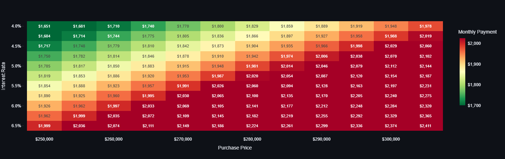

# 🏡 Mortgage Affordability Dashboard
Interactively explore how home prices, interest rates, and lending factors shape monthly payments.

[**Launch app on Streamlit**](https://mortgage-dashboard-fqmjntdeeqzedgcpbpnsev.streamlit.app/)  *No installs required &mdash; runs entirely in your browser*

---

## What It Does
This dashboard visualizes the relationship between **purchase price**, **interest rate**, and **monthly mortgage payment**, accounting for real-world costs like:
- property taxes
- homeowners & flood insurance 
- PMI & HOA fees

The interactive heatmap lets you quickly see how affordability shifts as these parameters change - ideal for homebuyers, analysts, or anyone curious about market sensitivity.

## How It Works
Under the hood:
- Built in Python + [Streamlit](https://streamlit.io/) &mdash; see *app.py* for the dashboard script that's hosted on Streamlit
- Uses [Plotly Express](https://plotly.com/python/plotly-express/) for the interactive heatmaps
- Dynamically recalculates payments using a standard P&I formula plus escrows & premiums &mdash; see the *house_buying.ipynb* notebook for the formulas and for building static heatmaps with [Seaborn](https://seaborn.pydata.org/)

Adjust the dashboard sliders and watch the heatmap update to explore affordability scenarios in real time.

## Run on Your Local Machine
You can run these commands from your terminal to deploy this dashboard on your local machine:

```bash
# 1. Clone this repo
git clone https://github.com/lcholmes91/mortgage-dashboard.git
cd mortgage-dashboard

# 2. Install dependencies
pip install -r requirements.txt

# 3. Launch the app
streamlit run app.py
```
Then open the local URL that Streamlit gives you &mdash; it should be something like *http://localhost:8501*.

---

## Why I Built This
I wanted a visual, interactive way to explore mortgage affordability &mdash; and an excuse to learn how to put together an interactive dashboard with Python.

## Contributing
Pull requests & ideas are welcome!
If you have feedback, feel free to [open an issue](https://github.com/lcholmes91/mortgage-dashboard/issues).
